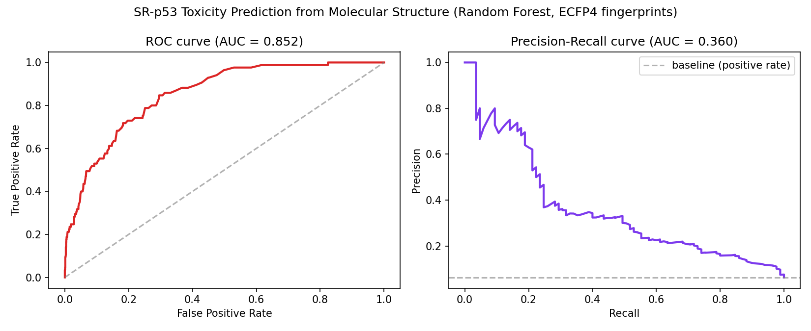
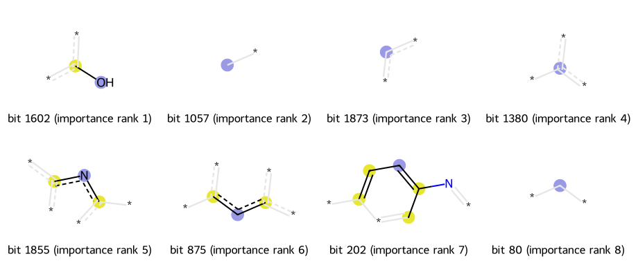

# molecular toxicity prediction (tox21 / SR-p53)

## what this does

Predicts whether a compound triggers the p53 stress-response pathway
(SR-p53 in the Tox21 dataset) directly from its molecular structure. p53
is basically the cell's DNA-damage alarm, so a positive here is a rough
proxy for carcinogenicity / genotoxic risk - the kind of signal you'd
actually want flagged early in drug development, long before a compound
gets anywhere near a clinical trial.

Pipeline:
1. take each molecule's SMILES string (a compact text representation of
   chemical structure) and convert it to an ECFP4 fingerprint (2048-bit
   vector encoding local substructures) using RDKit
2. train a Random Forest (and a Logistic Regression baseline) to predict
   the binary toxicity label from the fingerprint
3. pull out which fingerprint bits the Random Forest relied on most, and
   map those back to actual chemical substructures instead of leaving
   them as opaque bit indices

## dataset

Tox21 - a real NIH/EPA toxicology screening dataset, 6,767 compounds with
valid SMILES after cleaning, ~6% positive for SR-p53 (real imbalance, not
something I balanced artificially). It's a standard benchmark
(part of MoleculeNet) so my numbers are checkable against published
baselines, not just numbers I'm asserting are good.

## results

| model | ROC-AUC | PR-AUC |
|---|---|---|
| Logistic Regression | 0.777 | 0.294 |
| **Random Forest** | **0.852** | **0.360** |

Using ROC-AUC and PR-AUC instead of plain accuracy on purpose - with only
6% positives, a model that just predicts "not toxic" every time gets 94%
accuracy and is completely useless. 0.852 ROC-AUC is in line with what
published Tox21 baselines report for this task, which is the number I
actually care about since it means I'm not fooling myself with a broken
train/test split or leakage somewhere.



### what the model actually keyed on



Pulled the 8 fingerprint bits the Random Forest weighted highest and
mapped each back to the actual substructure in a real molecule from the
training set (using RDKit's Morgan bit visualization, so these are real
fragments from real compounds, not made up). A few of the top bits are
phenolic / aromatic-hydroxyl groups - which lines up with known
toxicology, since phenols can get metabolized into reactive quinone
intermediates that cause oxidative damage, which is exactly the kind of
stress that triggers a p53 response. Wasn't specifically looking for that
going in, and I want to be careful not to over-claim a story from 8 bits
out of 2048 - could easily be partially coincidental given how many bits
I didn't inspect - but it's a plausible enough signal that it made me
trust the model wasn't just pattern-matching noise.

## running it

```
pip install rdkit scikit-learn pandas numpy matplotlib
python3 preprocess.py     # SMILES -> ECFP4 fingerprints, saves X.npy / y.npy
python3 experiment.py     # trains RF + LogReg, prints metrics, saves results.json
```
Preprocessing takes under a minute, training under a minute too - fingerprints
are pre-computed so RF training itself is fast even on ~5,400 samples.

## limitations / what I'd want to check next

- only used one of the 12 assays in Tox21 (SR-p53). would want to check
  whether the same fingerprint + RF setup holds up across the other 11,
  or whether SR-p53 happens to be an easier one
- ECFP fingerprints throw away 3D structure entirely - a lot of real
  toxicity mechanisms depend on 3D shape/binding pose, so there's a
  ceiling here that a graph neural network or a 3D-aware model wouldn't
  have
- the phenol/quinone story from the top fragments is a plausible
  mechanism, not something I verified against actual metabolism data -
  would want to check it against known reactive-metabolite literature
  before treating it as more than a suggestive pattern
- single train/test split, no cross-validation - given how imbalanced
  the positive class is, results could shift somewhat with a different
  split

## data source

Tox21 dataset, via a public CSV mirror of the MoleculeNet-distributed
version on GitHub (originally from the NIH/EPA Tox21 screening program).
